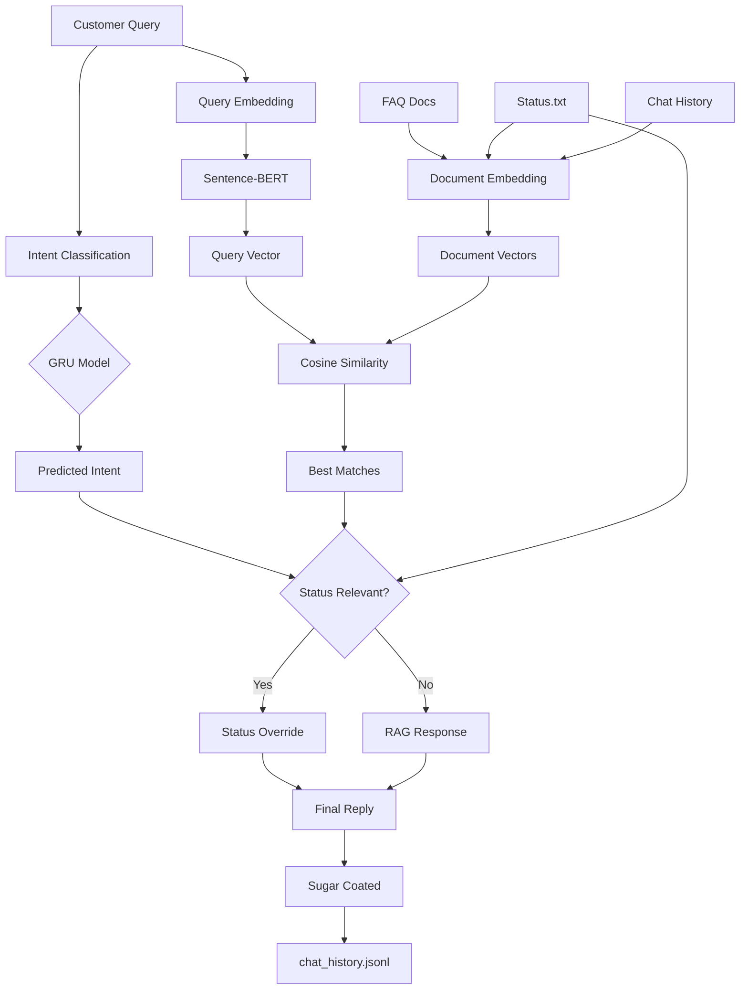

# AdaShield(Task 4) - Intelligent Customer Support Agent

Real-time AI-powered customer support system with intent classification, RAG-based retrieval, and live status monitoring.


## Overview

This automatically responds to customer queries by understanding intent, retrieving relevant information from FAQs, and prioritizing live system alerts when needed.

**Core Capabilities:**
- Intent classification using Bidirectional GRU neural network
- Semantic document search with Sentence-BERT embeddings (all-MiniLM-L6-v2, 384-dim)
- Real-time status monitoring with intelligent override logic (relevance-based decision making)
- Streaming query processing via Pathway framework (tested: 500+ queries in 8 seconds)

## Quick Start
1. Clone the Repo:
```bash
git clone https://github.com/mdminhaj-2106/AI-Powered-Customer-support.git
```
2. Build the image:
```bash
docker build -t adashield .
```

3. Run the container:
```bash
docker run --rm --user $(id -u):$(id -g) \
  -v "$(pwd)/status.txt:/app/status.txt" \
  -v "$(pwd)/queries.jsonl:/app/queries.jsonl" \
  -v "$(pwd)/policy_docs:/app/policy_docs" \
  -v "$(pwd)/chat_history.jsonl:/app/chat_history.jsonl" \
  adashield
```

> **Pre-loaded Data:** The repository includes sample data to get you started:
> - `queries.jsonl` - 100 sample customer queries
> - `status.txt` - Initial status ("All systems normal")
> - `policy_docs/faq.md` - Sample FAQ documentation
> - `chat_history.jsonl` - Empty, will be populated by the agent

## Algorithm



**Decision Logic:**
- If status is relevant to intent: Use status alert (based on keyword matching and intent correlation)
- Otherwise: Use RAG-retrieved answer from FAQs

## Usage

**Input** (`queries.jsonl`):
```json
{"customer_id": "user123", "message": "I forgot my password"}
```

**Status** (`status.txt`):
```text
Login server maintenance in progress.
```

**Output** (`chat_history.jsonl`):
```json
{"customer_id": "user123", "message": "I forgot my password", "reply": "LIVE STATUS UPDATE: Login server maintenance..."}
```

## Live Testing

The agent monitors files in real-time. To see it in action:

1. Start the container (it will process the 50 pre-loaded queries)
2. Update `status.txt` with an alert:
```bash
echo "URGENT: Login issues detected" > status.txt
```
3. Append new queries to test status override:
```bash
echo '{"customer_id": "test1", "message": "cant login"}' >> queries.jsonl
echo '{"customer_id": "test2", "message": "wheres my order"}' >> queries.jsonl
```
4. Watch `chat_history.jsonl` update in real-time
5. Observe which queries trigger status override vs RAG retrieval

**Expected Behavior:**
- `test1` (login issue) → Gets status alert
- `test2` (order query) → Gets RAG response from FAQ

## Supported Intents

- `PASSWORD_RESET` - Password recovery
- `LOGIN_ISSUE` - Authentication problems  
- `ORDER_STATUS` - Shipment tracking
- `REFUND_REQUEST` - Returns and refunds
- `TECHNICAL_ISSUE` - App crashes, bugs

## Status Override Rules

Status alerts override RAG responses when:
- Status mentions "login/server/outage" **AND** Intent is `LOGIN_ISSUE`/`TECHNICAL_ISSUE`
- Status mentions "promo/sale" **AND** Intent is `ORDER_STATUS`

## Model Details

**Intent Classifier:**
- Architecture: Bidirectional GRU
- Max sequence length: 20 tokens
- Training: Categorical cross-entropy on customer support dataset
- Files: `support_model.keras`, `tokenizer.pickle`, `encoder.pickle`

**Embedding Model:**
- Model: sentence-transformers/all-MiniLM-L6-v2
- Dimension: 384
- Purpose: Semantic similarity computation

**Pipeline:**
1. Stream queries via Pathway
2. Predict intent with GRU
3. Embed query and documents
4. Compute cosine similarity
5. Retrieve best matches per source (FAQ, status, history)
6. Apply status override logic
7. Generate final response

> **Training Notebook:** A Jupyter notebook demonstrating the GRU model training process is included in the repository.

## File Structure

```
├── app.py                    # Main pipeline
├── support_model.keras       # GRU intent classifier
├── tokenizer.pickle          # Text tokenizer
├── encoder.pickle            # Label encoder
├── queries.jsonl             # Input stream (100 sample queries included)
├── chat_history.jsonl        # Output stream (generated by agent)
├── status.txt                # Live status (initially "All systems normal")
├── policy_docs/              # FAQ documents
│   └── faq.md                # Sample FAQ
└── training_notebook.ipynb   # GRU model training code
```

## Viewing Results

The `chat_history.jsonl` can be difficult to read in raw form. Here are some options:

**Option 1: VS Code Extension**
- Install "Pretty JSONL" extension

**Option 2: Command Line**
```bash
# Stream formatted output
cat chat_history.jsonl | jq '.'

# Create a readable JSON file
jq -s '.' chat_history.jsonl > chat_history_readable.json
```

**Option 3: Watch live updates**
```bash
tail -f chat_history.jsonl | jq '.'
```

## Troubleshooting

| Issue | Solution |
|-------|----------|
| Container exits immediately | Verify all files exist with proper permissions |
| No responses generated | Check JSON format in `queries.jsonl` |
| UID warnings | Safe to ignore (Docker filesystem warnings) |
| Slow processing | First run loads models (~5s), subsequent queries are fast |
